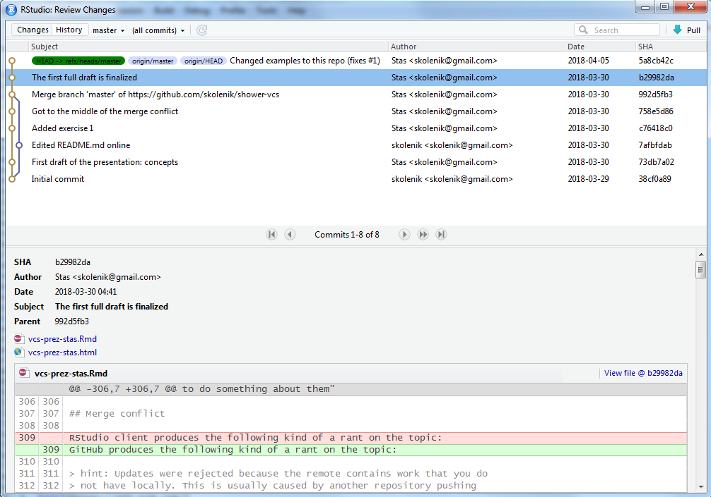

```{r setup, include=FALSE}
knitr::opts_chunk$set(echo = FALSE)
```

## Version control

Wikipedia [defines](https://en.wikipedia.org/wiki/Version_control) version control as

> management of changes to documents, computer programs, 
> large web sites, and other collections of information. 

To put it differently, this is a way to retain semblance of sanity 
when the inputs and the code keeps changing.

## Concepts

The major concepts concerning version control are:

1. Repository
2. Changeset
3. Commits
4. Distributed VCS: push/pull/merge

## Repository

It is easiest to think about repositories as projets. It is best to keep 1:1 relations between them,
although you can try more complicated relations with several code repositories within a project,
or, worse, a single repository serving different projects.

A repository is a collection of:

- files that you are working on, such as code or input data
- metadata about these files, namely the record of changes

## Ongoing example: this very presentation's repo

https://github.com/skolenik/shower-vcs

## Changeset

A changeset is a record in the repository of the changes that were made to its state.

Each changeset is assigned a random hex string, usually of at least a dozen characters, if not two dozen,
to uniquely identify it.

## Commits

Once the code developer decides they have made a reasonable number of changes, 

Commit is the action of adding a changeset to the repository.

In every VCS, a commit message is required to accompany the commit and 
describe what this commit/changeset achieves.

## Scope

What's an appropriate scope for a changeset? Well, ideally, whatever you can describe in 
one sentence that would be visible when you view your repo!

> A matching bracket is fixed in `load_data.py`

or can be 

> Web scraping code is added

which could add 25 files to the repo -- but this would still be a good changeset with a specific purpose. 

## Stas' ongoing example: a random changeset in this repo

https://github.com/skolenik/shower-vcs/commit/c76418c0e

Go back to the list of commits to see how the commit message is displayed

https://github.com/skolenik/shower-vcs/commits/master

## Branches 

Distributed VCSs allow different users/developers to work on their part of the project
independently. E.g., one team could work on the engine, another on inputs in the user interface, 
and yet another on the outputs. In analytic projects, some people may be working on data
acquisition and cleaning, while others could prepare analysis templates and narratives
(in markdown).

## Push/pull

Each user can work on their own copy of the repository, making commits to that copy.
However, periodically (EOB? end of the week?) everybody need to synchronize their state of the
project to make sure that the different pieces really work together. To that effect,
distrbiuted VCS have two specific actions: *push* and *pull*.

## Push/pull

- *push* is the action of uploading your local commits (all of them) to the centralized, master
copy of the repository (typically, a repository on GitHub.com, BitBucket.org, Kiln on FogCreek, etc.)
- *pull* is the action of downloading the commits from the master repository to your own local copy

## Merge

As you can clearly imagine, push/pull operation can easily create conflicts.
What if two or more different people made changes between their respective
pushes to the master repository? What should the resulting state be after all developers
push their code?

The issue is known as *merge*. Sometimes, merges are clean -- i.e., when different people
worked on different files, or each file was worked on by one person at a time.

## Merge

Other times, merges require intervention of a knowledgeable human to determine how 
the conflicts are to be resolved. Typically, VCS clients (see below) offer meaningful options,
e.g., by taking the union of the changes. But sometimes, manual editing may be required
when e.g. different developers worked on the same file.

## Example of a merge in this prez repo

https://github.com/skolenik/shower-vcs/commit/992d5fb311e

## 



## Issue tracking

While not necessarily a part of a version control system, *issue trackers*
are a useful addition to them. When you see an email from your IT support titled like
"*Ticket #1054347: Excel does not open on my computer*", it is generated by
the issue tracking system that your IT uses.

- a bug (most typical in software development)
- a task (e.g., consolidating or refactoring the code)
- an enhancement or a feature request

## Analysis plan in issue trackers

In the world of data analytic projects, an analysis plan can be converted
to a series of "issues", with subsequent development of the code addressing,
and closing, these issues.

## Issue trackers and commit messages

A neat way to bring together the concepts of commits and issues is through 
markup of commit messages. Typically, the following conventions are understood 
by the different VCS:

- a hash sign # denotes an issue
- a hex string denotes a changeset
- text like "*fixed*" or "*resolved*"

## There, I fixed it for you

Most modern VCS would be able to parse the message

> Commit 45ef0da2c fixes issue # 237: input file is not updated in code/refresh_plot.py 

and identify all three components: the changeset, the issue, and the file. Moreover,
the issue will get closed/resolved automatically with such a commit message.

## The first issue with this presentation

https://github.com/skolenik/shower-vcs/issues/1

Check how it got closed by the commit message

## VCS wars

There are three major version control systems:

1. [Git](https://git-scm.com/)
1. [Mercurial/Hg](https://www.mercurial-scm.org/)
1. Apache [Subversion/SVN](https://subversion.apache.org/)

They share the common functionality, and while the differences are mostly in esoteric issues,
these differences divide the developers into intensely loyal camps.

## Client wars

But there is more. While version control *engines* run from command line, there are also neat
GUIs, or clients, to visualize the processes --- and they cause wars, too.

1. Atlassian [SourceTree](https://www.sourcetreeapp.com/) -- supports both Git and Mercurial
1. [TortoiseHg](https://tortoisehg.bitbucket.io/) -- Mercurial only
1. [SmartGit](https://github.com/skolenik/shower-vcs/issues/1) -- both Git and Mercurial, with compormises

and many others. They obviously differ somewhat in what they can do, and which of the more
complex functions are supported.

## Time to play!

Enough said! Let's go break some things!

Prerequisites:

- an account on https://github.com or https://bitbucket.org
- a VCS client -- any one mentioned on the previous slide
  * RStudio has a built-in Git client, too
- desire to learn!

## Exercise 1: create a repo

For a number of reasons, a better workflow is to create a repository online first,
and then fold it into your local work. So, create a repository (let's name it `sandbox`)
on [GitHub](https://github.com) or [BitBucket](https://bitbucket.org), 
depending on where you have an account. You can use the default settings...
we will delete this repository anyway. Please make sure that `README.md` file gets 
created, though.

## Exercise 2: clone a repo

The next step is to create the infrastructure for your project locally.
This is the *clone* operation. Find out using your client how this is done.
Since this is always the first step in the client, 
it would be conceptually similar to `File/Open`, so you should expect
to find the relevant buttons/controls somewhere in the upper left corner of
the client's GUI.

## Exercise 2: clone a repo

In RStudio, you can clone a GitHub repo with `File/New Project/Version Control/Git`.

Point your client to an empty folder. If you have some code that you are
itching to put under version control, we will copy it down at the next step.

## Exercise 3: make local changes

- Copy some existing code (do not delete your actual work though!)

or 

- Create some sort of "*Hello, world*" file.

## Exercise 4: find how the client identifies changes

Go back to your client. (In TortoiseHg, you need to hit "Refresh" button.)
Most likely, you will be shown some sort of a display of your folder,
with the files that you created or copied. You will most likely see 
question marks (intended to indicate
that your client does not yet know whether you want to add that file to the repo).
Clicking on the files, you will see some content.

## Exercise 5: commit the changes

Select the files with the question marks that you want to be added to the project
(maybe all of them if there are more than one). (Git has an intermediate concept of *staging*;
your Git client will have a separate area with the files in the directory, and the "stage" area,
and will have a "Stage" button and probably "Stage All" button, too.)

Write a commit message -- this can be something optimistic like "My first commit ever!"

## Exercise 6: push the chages

The next step would be to push the changes to the server. 
- You can reasonably expect the relevant button to show an arrow going up.
- You will be asked for your GitHub/BitBucket username and password. Enter them.

## Exercise 7: view from the other side

Go back to your repo online on GitHub/BitBucket, and reload it. Observe where the changes
are, and how the server shows them.

Identify the hex ID of the changeset in both the client and on the server. 
You don't need it know, but you need to know where to look for one.

## Exercise 8: create a conflict!

This will be a common situation with your repos, so the earlier you learn to deal with it,
the better. We will create conflicting commits in different branches of the project,
and try to figure out how to deal with them.

## Exercise 8a: make changes on the server

Click on `README.md` file in your repo to edit it. It will probably look like this:

```
# sandbox
Some description
```

Change the description to "This is my sandbox to play with version control."
Note that you actually have a "Commit" button rather than "Save"  button; whatever you edit online
gets committed immediately.

## Exercise 8b: make local changes

Go back to your local version of the repository and make local changes
- add more files from elsewhere
- add another line of "Hello world again!" to your basic file

Commit the changes -- you know how to do that

## Exercise 8c: conflict revealed!

Try pushing the local changes up the server. 

You should get an error message that will probably be cryptic,
but it should convey something like "You tried pushing things to the server,
but there were some changes there that are not compatible with yours. You need
to do something about them"

## Merge conflict

GitHub produces the following kind of a rant on the topic:

> hint: Updates were rejected because the remote contains work that you do
> not have locally. This is usually caused by another repository pushing
> to the same ref. You may want to first integrate the remote changes
> (e.g., 'git pull ...') before pushing again.
> See the 'Note about fast-forwards' in 'git push --help' for details.

It really makes things more complicated than they need be.

## Exercise 8d: pull

Let us try to resolve the issue by working in the local repository.
*Pull* the changes that happened elsewhere.
Your client should have the pull button somewhere prominently, and it will likely
have a downward pointing arrow. You may be asked for the username and password again.

After the pull, you should get the updated `README.md` file. That's where the change was, remember?

## Exercise 8e: merge

Identify the *merge* control in your client. It will say "`Merge`", and it will likely have 
arrows or lines merging. When you click it, you will see a moderately complex screen showing
what the changes have been in the different branches of the project. At the moment, we have a nice,
clean merge, with the remote changes confined to `README.md`, and everything else happening locally
with the files that you worked with. Hit "`OK`" or whatever is needed to finalize the operation.
You may or may not have a chance to enter a commit message -- it will likely be an automated
"Merge", anyway.

## Exercise 8f: push again

Now that the local repo does not have any conflicts, you can push the neatly merged
set of changesets back to the server. Hit the "Push" button, and notice that your client
will likely say that it is preparing and pushing several changesets. Go back to the server
and validate that all of the changes have propagated.

## Extra credit

1. Create an issue on GitHub/BitBucket in your repo.
2. Modify your code to address it.
3. Commit with the message stating the the issue was fixed.
4. Push.
5. Study the trace of the issue, the human and computer-generated messages.

## That's it folks

Please review that you did today. Look again at the changes in the client
and on the server (<font color="red">red</font> to show the text taken out; 
<font color="green">green</font> to show the text that was added.)

This probably covers 80% of what you will be doing, in terms of version control.

## Other VCS operations

- Revert files to a given revision level
- Create additional branches 
- Ignore files (e.g., input data sets that are just too big)

## Other GitHub operations

- Fork a repo
- Create a pull request

## Issue tracking

Different clients differ in their support of issues.
Typically, though, you can manage issues on the server.

## R Markdown

This is an R Markdown presentation. Markdown is a simple formatting syntax for authoring 
HTML, PDF, and MS Word documents. For more details on using R Markdown see http://rmarkdown.rstudio.com.

This presentation is delivered by [shower](https://github.com/shower/shower) HTML presentation engine.

The GitHub repo where this presentation lives is https://github.com/skolenik/shower-vcs.
